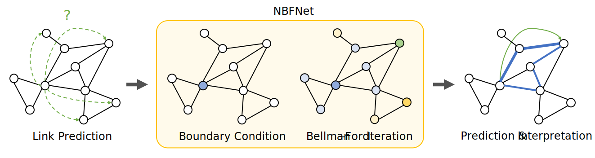

# NBFNet: Neural Bellman-Ford Networks #

[MLX] re-implementation of [NBFNet] for Apple Silicon with the [mlx-graphs] framework for building GNNs. 
Runs natively on GPUs built into any M1, M2, M3, and newer chip! Developed and tested on M2 Max (32 GB).

[MLX]: https://github.com/ml-explore/mlx
[NBFNet]: https://github.com/DeepGraphLearning/NBFNet
[mlx-graphs]: https://github.com/mlx-graphs/mlx-graphs

## Overview ##

NBFNet is a graph neural network framework inspired by traditional path-based
methods. It enjoys the advantages of both traditional path-based methods and modern
graph neural networks, including **generalization in the inductive setting**,
**interpretability**, **high model capacity** and **scalability**. 



Because MLX still lacks certain numpy and torch primitives, this repo implements NBFNet for inductive KG completion on 12 GraIL datasets. Once those primitives are implemented, the repo can be extended to more tasks and datasets (including larger transductive graphs).

### TODOs

 - [x] Upstream the `GeneralizedRelationalConv` layer into mlx-graphs. [Done!](https://github.com/mlx-graphs/mlx-graphs/pull/111) Will likely to be featured in mlx-graphs 0.0.4 and later
 - [ ] Upstream inductive KG datasets into mlx-graphs
 - [ ] Update `edge_match` and `strict_negative_sampling` functions when `meshgrid` and `bucketize` are implemented in the core MLX

## Installation ##

A few dependencies are `mlx`, `mlx-graphs`, `numpy`, and a few others found in `requirements.txt`

### From Pip ###

```bash
pip install mlx
pip install mlx-graphs
pip install Jinja2 easydict pyyaml
```

## Reproduction ##

First, go to the `configs` and specify full paths to the folders for downloading datasets (`dataset.root`)
and storing experiments results (`output_dir`)

To reproduce the results of NBFNet, use the following command. All the datasets will be automatically
downloaded in the code.

```bash
python script/run.py -c config/inductive/fb15k237.yaml --version v1
```

We provide the hyperparameters for each experiment in configuration files.
All the configuration files can be found in `config/*/*.yaml`.

Right now, only FB/WN/NELL inductive datasets are supported with 4 versions each (12 in total).

## Results ##

The *Best reported NBFNet* result is that from the [A*Net paper](https://arxiv.org/pdf/2206.04798.pdf) (Table 11 in Appendix), its [Github repo](https://github.com/DeepGraphLearning/AStarNet).

More experimental reproduction results are welcome - submit a PR!
<table>
    <tr>
        <th rowspan="2">Baseline vs MLX</th>
        <th colspan="2">FB v1</th>
    </tr>
    <tr>
        <th colspan="1">MRR</th>
        <th colspan="1">Hits@10</th>
    </tr>
    <tr>
        <th>Best reported NBFNet</th>
        <td>0.422</td>
        <td>0.574</td>
    </tr>
    <tr>
        <th>NBFNet MLX</th>
        <td>0.417</td>
        <td>0.526</td>
    </tr>
</table>


## Citation ##

If you find this codebase useful in your research, please cite the original paper.

```bibtex
@article{zhu2021neural,
  title={Neural bellman-ford networks: A general graph neural network framework for link prediction},
  author={Zhu, Zhaocheng and Zhang, Zuobai and Xhonneux, Louis-Pascal and Tang, Jian},
  journal={Advances in Neural Information Processing Systems},
  volume={34},
  year={2021}
}
```
And the latest numbers from the A*Net paper.
```bibtex
@article{zhu2022scalable,
  title={A*Net: A Scalable Path-based Reasoning Approach for Knowledge Graphs},
  author={Zhu, Zhaocheng and Yuan, Xinyu and Galkin, Mikhail and Xhonneux, Sophie and Zhang, Ming and Gazeau, Maxime and Tang, Jian},
  journal={Advances in Neural Information Processing Systems},
  volume={36},
  year={2023}
}
```
